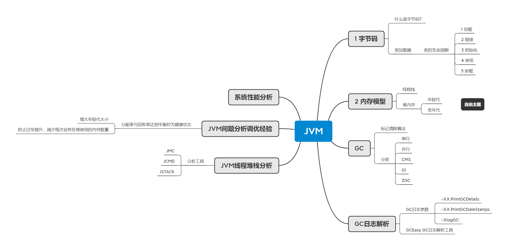
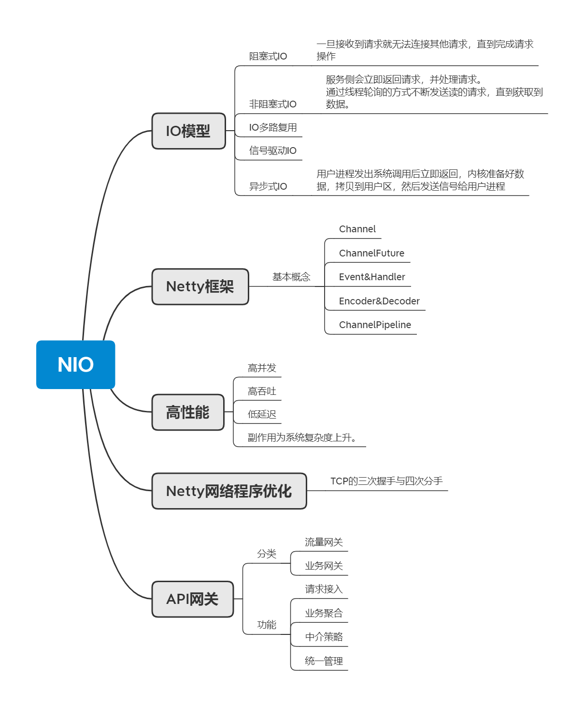
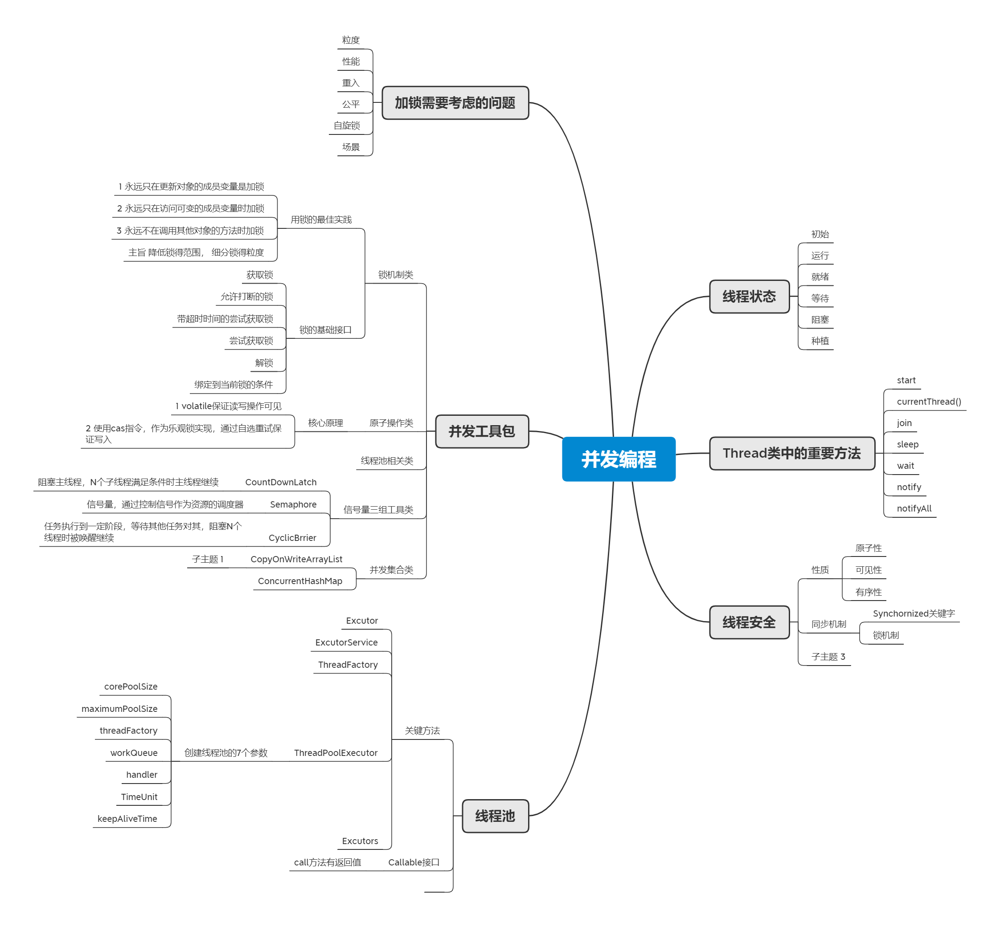
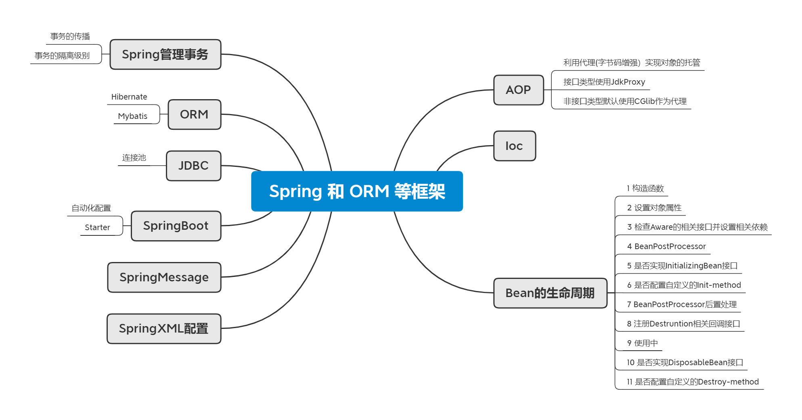

## 01 JVM
### 从字节码到JVM内存模型，内存管理，性能调优涉及了很多知识点。内存模型，内存管理模型为指导性能问题的出发点，通过分析分配率与回收率，得到产生问题的关键点。

## 02 NIO
### 非阻塞网络请求处理的成熟框架.不懂的点太多，待以后好好学习一下。

## 03 并发编程
### 为了保证线程安全，使用锁，原子类等机制来满足需求，同时在使用锁时需要注意的点是锁的范围尽量要小，细分锁的粒度。为了能够服用创建的线程，可以使用线程池来创建，异步结果的读取与异步编排通过CompletableFuture实现。

## 04 Spring 和 ORM 等框架
### Spring的核心AOP与IOC是Spring的两大核心机能，通过AOP实现各种机能的增强。SpringBoot是利用自动配置的放是将Spring的配置简化。ORM中常用的框架有Mybatis与Hibernate。

