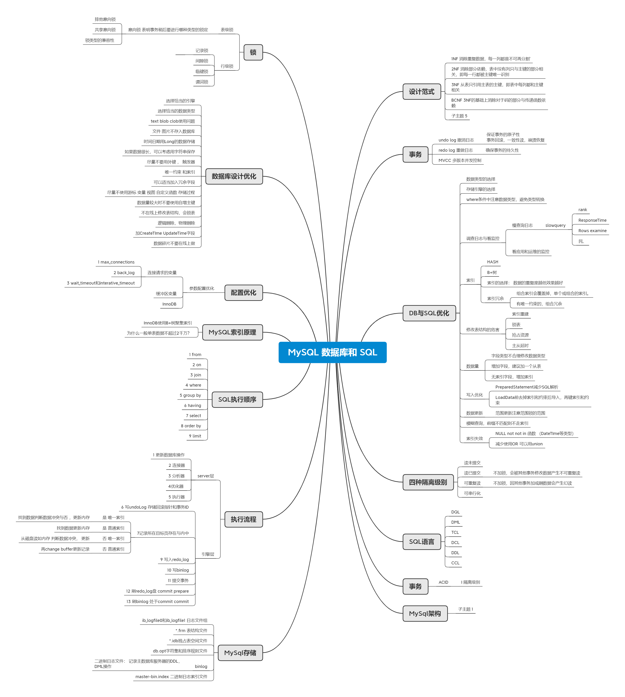
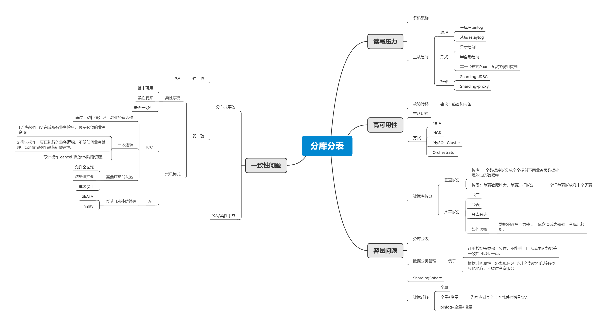
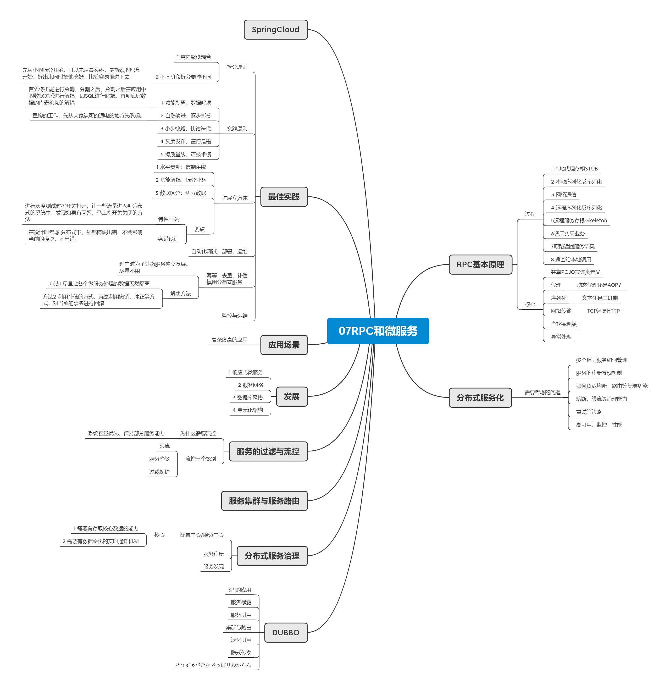
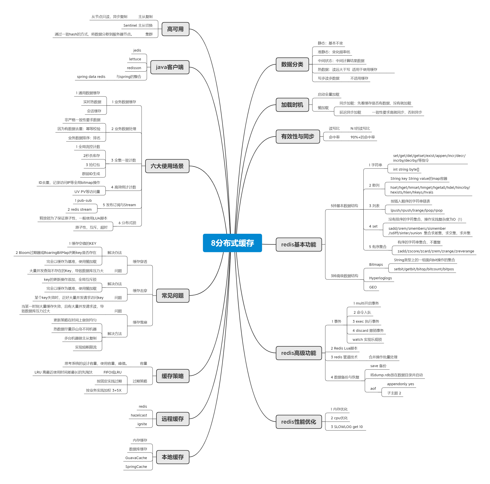
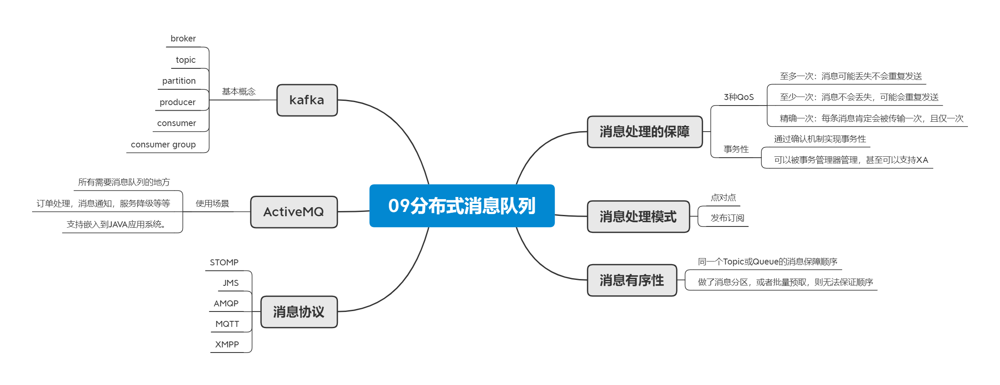

## 01 JVM
### 从字节码到JVM内存模型，内存管理，性能调优涉及了很多知识点。内存模型，内存管理模型为指导性能问题的出发点，通过分析分配率与回收率，得到产生问题的关键点。

## 02 NIO
### 非阻塞网络请求处理的成熟框架.不懂的点太多，待以后好好学习一下。

## 03 并发编程
### 为了保证线程安全，使用锁，原子类等机制来满足需求，同时在使用锁时需要注意的点是锁的范围尽量要小，细分锁的粒度。为了能够服用创建的线程，可以使用线程池来创建，异步结果的读取与异步编排通过CompletableFuture实现。

## 04 Spring 和 ORM 等框架
### Spring的核心AOP与IOC是Spring的两大核心机能，通过AOP实现各种机能的增强。SpringBoot是利用自动配置的放是将Spring的配置简化。ORM中常用的框架有Mybatis与Hibernate。

## 05 MySQL 数据库和 SQL
### 数据库设计中的几个最佳实践，与数据库性能的调优。SQL的性能调优。

## 06 分库分表
### 分库分表的实现场景为数据容量大导致数据库查询成为瓶颈的场景，实现方式大致分为垂直和水平两种。分布式场景下数据一致性的解决方案大致分为，支持强一致性的XA事务，支持柔性事务的TCC AT事务模式。

## 07RPC和微服务
### 远程方法调用的基本原理与DUBBO框架的架构，微服务架构的发展与微服务的应用场景。微服务的最佳实践原则等。

## 08 分布式缓存
### 缓存的使用场景是针对热数据，并且需要有较高的命中率与读写比。缓存中的常见问题与解决方法。redis缓存的6大使用场景，redis的高可用方案等。

## 09 分布式消息队列
### 消息队列的基本概念以及消息队列的使用场景。
